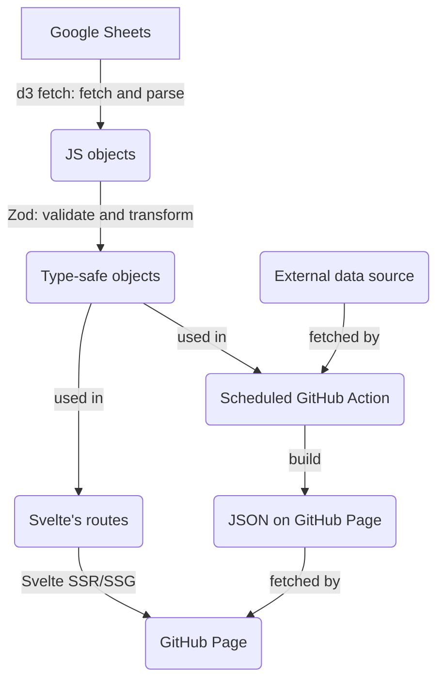

# 👀 Parliament Watch

Citizens are watching

> **Hacktoberfest 2024 is here!** every constibutor will receive a Parliament Watch sticker ✨ [see more](https://www.facebook.com/wevisdemo/posts/pfbid06t4zjUoG2noQW1pow9PiN2wmVQpUTHUSyE44SZcpP7bAaRRGaQy9JU1iWpUnVQAnl)


**Table of Content**

<!-- START doctoc generated TOC please keep comment here to allow auto update -->
<!-- DON'T EDIT THIS SECTION, INSTEAD RE-RUN doctoc TO UPDATE -->

- [⭐ Goal](#-goal)
- [🌎 Environments](#-environments)
- [🍱 Tech Stack](#-tech-stack)
  - [Front-end](#front-end)
  - [Local development](#local-development)
  - [Deployment pipeline](#deployment-pipeline)
- [🪄 Useful Commands](#-useful-commands)
  - [Start SvelteKit](#start-sveltekit)
  - [Start Histoire](#start-histoire)
  - [Generate a new component](#generate-a-new-component)
  - [Log](#log)
- [🗃️ Directory Structure](#-directory-structure)
- [🍭 Design System](#-design-system)
  - [Typography](#typography)
  - [Colors](#colors)
  - [Components](#components)
  - [Icons](#icons)
- [💾 Data Pipeline](#-data-pipeline)
- [🤝 Contributing Guideline](#-contributing-guideline)
- [📜 License and Terms of Use](#-license-and-terms-of-use)

<!-- END doctoc generated TOC please keep comment here to allow auto update -->

## ⭐ Goal

We want to record and visualise the Thai parliament information including politicians, assemblies, bills, voting processes, and promises.

This project can be seen as a renovated combination of [They Work for Us](https://github.com/wevisdemo/they-work-for-us), [Law Watch](https://github.com/wevisdemo/law-watch), and [Promise Tracker](https://github.com/wevisdemo/promise-tracker) which aim to support several election era.

## 🌎 Environments

| Name                  | URL                                |
| --------------------- | ---------------------------------- |
| Production            | https://parliamentwatch.wevis.info |
| Staging (main branch) | https://parliament-watch.pages.dev |

## 🍱 Tech Stack

### Front-end

- [Svelte](https://svelte.dev) + [SvelteKit](https://kit.svelte.dev)
- [TypeScript](https://www.typescriptlang.org/)
- [Carbon Design System (v10)](https://v10.carbondesignsystem.com) + [Carbon Components Svelte](https://carbon-components-svelte.onrender.com)
- [TailwindCSS](https://tailwindcss.com)
- [Histoire](https://histoire.dev/) for the components documentation

### Local development

- [Yarn v1](https://classic.yarnpkg.com) as a package manager
- Husky and lint-staged will
  - Lint (ESLint) and format (Prettier) code before commiting
  - Validate that commit message is align with [conventional commit](https://www.conventionalcommits.org/en/v1.0.0/) using commitlint
  - Run svelte-check before pushing
- For VSCode user, format on save is enabled and [prettier-vscode extension](https://marketplace.visualstudio.com/items?itemName=esbenp.prettier-vscode) will be recommended when open the project.
- [Hygen](http://www.hygen.io) for a code generation

### Deployment pipeline

- **Staging**: Each push will trigger the [Github Actions Workflow](.github/workflows/staging.yml) to build the site, upload the build artifact, and deploy on [Cloudflare Pages](https://pages.cloudflare.com). Can also be triggered manually.
- **Production**: The [Github Actions Workflow](.github/workflows/staging.yml) can only be manually triggered to download the latest build artifact and upload to our server through SSH.

## 🪄 Useful Commands

### Start SvelteKit

Start the project in development mode

```bash
yarn dev
```

### Start Histoire

to see/develop custom components from Histoire's stories

```bash
yarn story:dev
```

### Generate a new component

For a shared component

```bash
yarn gen:component
```

_src/components/ComponentName/_ directory will be created with the following files:

- **ComponentName.svelte** for the component source code.
- **ComponentName.story.svelte** for the Histoire's story file. Follow [a guide on writing stories](https://histoire.dev/guide/svelte3/stories.html).

### Log

Server-side logging for data warning and SvelteKit error can be enabled via environment variable `process.env.LOG_TARGET` by setting it to `stdout` or `file`. More details in [logger.ts](src/lib/logger.ts).

## 🗃️ Directory Structure

- **/\_templates** Hygen's code generation templates
- **/.husky** Husky's git hooks
- **/src** main source codes
  - **/components** Svelte's components
  - **/mocks** Mock data, while we still don't have backend
  - **/models** Main data structure defined with TypeScript interface
  - **/routes** Sveltekit's routes
  - **/styles** Stylesheets, including custom Carbon Design System, tailwind and fonts
- **/static** static assets such as logos

## 🍭 Design System

The project design system is based on Carbon Design System v10 with some modification. Custom theme is defined with scss in [src/styles/carbon/](src/styles/carbon/). To reduce overhead on development, we compile Carbon related stylesheet into _src/styles/carbon/precompiled.css_ with `yarn sass:build` command.

### Typography

- The utility classes is globally available as declared in [typography.scss](src/styles/carbon/typography.scss)
- See [Figma file](<https://www.figma.com/file/wydykFjb2U2SLFIz5YmiE8/(v11)-Text-Styles---IBM-Design-Language-(Community)>)

### Colors

- [tailwind.config.js](tailwind.config.js) define utility classes based on color function name according to the Carbon's theme (see [Figma file](<https://www.figma.com/file/JhpIXQHbn07yn2GVD806dA/(v10)-White-Theme---Carbon-Design-System-(Community)>))
- scss variable (need to be imported where you want to use)
  - [colors.scss](src/styles/carbon/colors.scss) define variable of all color palette (see [Figma file](<https://www.figma.com/file/DLpm4GWpqa1BUEWApXGeGc/Color-Styles---IBM-Design-Language-(Community)>))
  - [theme.scss](src/styles/carbon/theme.scss) define variable according to the Carbon theme's color function name (see [Figma file](<https://www.figma.com/file/JhpIXQHbn07yn2GVD806dA/(v10)-White-Theme---Carbon-Design-System-(Community)?node-id=169%3A0>))

### Components

- Use [Carbon Components Svelte](https://carbon-components-svelte.onrender.com)
- We have custom shared component available in [src/components/](src/components/).
  - To see shared components' story, open Histoire in local with `yarn story:dev` or browse it in the [staging/stories](https://parliament-watch.pages.dev/stories)
  - See all planned component in [Figma file.](https://www.figma.com/file/cdtZnPegHm5CGHWqIND5Im/Design_Phase01?node-id=40%3A67247)
- If the component is not yet developed:
  - If the component is used by only a specific route, create it in _src/components/route-name-and-sub-route-if-exist/_
  - If the component is shared, run `yarn gen:component` to generate a new component. Don't forget to update a story file for the component documentation.

### Icons

- Use [Carbon Icons Svelte](https://carbon-icons-svelte.onrender.com)
- We have customed icon available in [src/components/icons](src/components/icons), using the same props as Carbon's icon. (Also available in Histoire)
- See [Figma file](<https://www.figma.com/file/TUob8dLak4FMugrqMQRm3R/Icons---IBM-Design-Language-(Community)>)

## 💾 Data Pipeline

Data is pre-process server-side during the build step as following



- Original data is avaiable at our public [Google Sheets](https://docs.google.com/spreadsheets/d/1SbX2kgAGsslbhGuB-EI_YdSAnIt3reU1_OEtWmDVOVk/edit?usp=sharing)
- [lib/datasheets](src/lib/datasheets/index.ts) provides fetch functions for each tables wrapping [d3-fetch](https://d3js.org/d3-fetch#csv) and [Zod](https://zod.dev)'s validation.
- Zod's schema for each data table are defined in [src/models](src/models) which also contains ER Diagram and other TypeScript's interfaces.
- Some data, such as politician ranking from external source, will be updated periodically through [scheduled Github Action](.github/workflows/update-ranking.yml) to reduce unnessesary build-time. The output JSON data is [served through Github Pages](https://wevisdemo.github.io/parliament-watch/politician-ranking.json) and can be fetch from the client-side.

## 🤝 Contributing Guideline

Please read [CONTRIBUTING.md](CONTRIBUTING.md)

## 📜 License and Terms of Use

Read more at [WeVis's Terms of Use](https://wevis.info/terms-of-use/) (in Thai)
