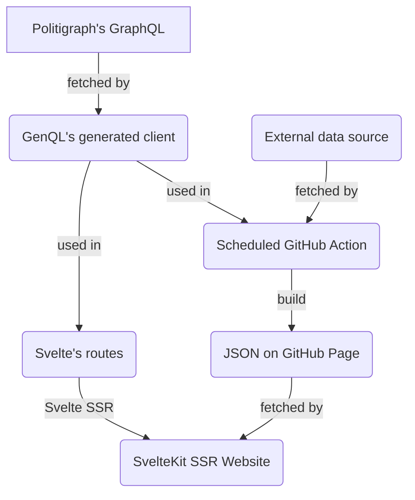

# 👀 Parliament Watch

Citizens are watching.


**Table of Contents**

<!-- START doctoc generated TOC please keep comment here to allow auto update -->
<!-- DON'T EDIT THIS SECTION, INSTEAD RE-RUN doctoc TO UPDATE -->

- [⭐ Goal](#-goal)
- [🌎 Deployment](#-deployment)
- [🍱 Tech Stack](#-tech-stack)
  - [Front-end](#front-end)
  - [Local development](#local-development)
  - [CI/CD pipeline](#cicd-pipeline)
- [💾 Data Source](#-data-source)
- [🗃️ Directory Structure](#-directory-structure)
- [🪄 Useful Commands](#-useful-commands)
  - [Start SvelteKit](#start-sveltekit)
  - [Start Histoire](#start-histoire)
  - [Generate a new component](#generate-a-new-component)
  - [Log](#log)
- [🍭 Design System](#-design-system)
  - [Typography](#typography)
  - [Colors](#colors)
  - [Components](#components)
  - [Icons](#icons)
- [Environment Variables](#environment-variables)
- [🤝 Contributing Guideline](#-contributing-guideline)

<!-- END doctoc generated TOC please keep comment here to allow auto update -->

## ⭐ Goal

We want to record and visualise Thai parliament information, including politicians, assemblies, bills, voting processes, and promises.

This project can be seen as a renovated combination of [They Work for Us](https://github.com/wevisdemo/they-work-for-us), [Law Watch](https://github.com/wevisdemo/law-watch), and [Promise Tracker](https://github.com/wevisdemo/promise-tracker), which aim to support several election eras.

## 🌎 Deployment

| Name                  | URL                                |
| --------------------- | ---------------------------------- |
| Production            | https://parliamentwatch.wevis.info |
| Staging (main branch) | https://parliament-watch.pages.dev |

## 🍱 Tech Stack

### Front-end

- [Svelte](https://svelte.dev) + [SvelteKit](https://kit.svelte.dev)
- [TypeScript](https://www.typescriptlang.org/)
- [Carbon Design System (v10)](https://v10.carbondesignsystem.com) + [Carbon Components Svelte](https://carbon-components-svelte.onrender.com)
- [TailwindCSS](https://tailwindcss.com)
- [Histoire](https://histoire.dev/) for component documentation

### Local development

- [pnpm](https://pnpm.io) as a package manager
- Husky and lint-staged will
  - Lint (ESLint) and format (Prettier) code before committing
  - Validate that commit message is aligned with [conventional commit](https://www.conventionalcommits.org/en/v1.0.0/) using commitlint
  - Run svelte-check before pushing
- For VS Code users, format on save is enabled and the [prettier-vscode extension](https://marketplace.visualstudio.com/items?itemName=esbenp.prettier-vscode) will be recommended when you open the project.
- [Hygen](http://www.hygen.io) for code generation

### CI/CD pipeline

- **Staging**: Each push will trigger the [GitHub Actions workflow](.github/workflows/staging.yml) to build the site, upload the build artifact, and deploy it to [Cloudflare Pages](https://pages.cloudflare.com). It can also be triggered manually.
- **Production**: The [GitHub Actions workflow](.github/workflows/staging.yml) can only be triggered manually to download the latest build artifact and upload it to our server through SSH.

## 💾 Data Source

Parliament Watch fetches data from [Politigraph](https://politigraph.wevis.info), a civic-initiated open API for Thai political data. We use [GenQL](https://genql.dev) to generate a type-safe GraphQL client, which communicates with the [Politigraph GraphQL endpoint](https://politigraph.wevis.info/graphql).


```mermaid
flowchart TD
    B[Politigraph's GraphQL] --> |fetched by| C(GenQL's generated client)
    C --> |used in| D(Svelte's routes)
    D --> |Svelte SSR| E(dev/prod website)
    C --> |used in| G(Scheduled GitHub Action)
    F(External data source) --> |fetched by| G
    G --> |build| H(JSON on GitHub Page)
    H --> |fetched by| E(SvelteKit SSR Website)
```

## 🗃️ Directory Structure

- **/\_templates** Hygen's code generation templates
- **/.husky** Husky's git hooks
- **/src** main source code
  - **/components** Svelte's components
  - **/mocks** Mock data while we still do not have a backend
  - **/models** Main data structures defined with TypeScript interfaces
  - **/routes** SvelteKit's routes
  - **/styles** Stylesheets, including the custom Carbon Design System, Tailwind, and fonts
- **/static** Static assets such as logos

## 🪄 Useful Commands

### Start SvelteKit

Start the project in development mode.

```bash
pnpm run dev
```

### Start Histoire

To see and develop custom components from Histoire's stories.

```bash
pnpm run story:dev
```

### Generate a new component

For a shared component

```bash
pnpm run gen:component
```

The `/src/components/ComponentName/` directory will be created with the following files:

- **ComponentName.svelte** for the component source code.
- **ComponentName.story.svelte** for the Histoire story file. Follow [a guide on writing stories](https://histoire.dev/guide/svelte3/stories.html).

### Log

Server-side logging for data warnings and SvelteKit errors can be enabled via the `process.env.LOG_TARGET` environment variable by setting it to `stdout` or `file`. More details are in [logger.ts](src/lib/logger.ts).

## 🍭 Design System

The project design system is based on Carbon Design System v10 with some modifications. The custom theme is defined with SCSS in [src/styles/carbon/](src/styles/carbon/). To reduce development overhead, we compile Carbon-related stylesheets into `src/styles/carbon/pre-compiled.css` with the `pnpm run sass:build` command.

### Typography

- The utility classes are globally available as declared in [typography.scss](src/styles/carbon/typography.scss).
- See [Figma file](<https://www.figma.com/file/wydykFjb2U2SLFIz5YmiE8/(v11)-Text-Styles---IBM-Design-Language-(Community)>)

### Colors

- [tailwind.config.js](tailwind.config.js) defines utility classes based on color function names according to the Carbon theme (see [Figma file](<https://www.figma.com/file/JhpIXQHbn07yn2GVD806dA/(v10)-White-Theme---Carbon-Design-System-(Community)>)).
- SCSS variables, which need to be imported wherever you want to use them:
  - [colors.scss](src/styles/carbon/colors.scss) defines variables for the full color palette (see [Figma file](<https://www.figma.com/file/DLpm4GWpqa1BUEWApXGeGc/Color-Styles---IBM-Design-Language-(Community)>)).
  - [theme.scss](src/styles/carbon/theme.scss) defines variables according to the Carbon theme's color function names (see [Figma file](<https://www.figma.com/file/JhpIXQHbn07yn2GVD806dA/(v10)-White-Theme---Carbon-Design-System-(Community)?node-id=169%3A0>)).

### Components

- Use [Carbon Components Svelte](https://carbon-components-svelte.onrender.com).
- We have custom shared components available in [src/components/](src/components/).
  - To see the shared components' stories, open Histoire locally with `pnpm run story:dev`.
- If the component is not yet developed:
  - If the component is used by only a specific route, create it in `/src/components/route-name-and-sub-route-if-exist/`.
  - If the component is shared, run `pnpm run gen:component` to generate a new component. Do not forget to update the story file for the component documentation.

### Icons

- Use [Carbon Icons Svelte](https://carbon-icons-svelte.onrender.com).
- We have custom icons available in [src/components/icons](src/components/icons), using the same props as Carbon's icons. They are also available in Histoire.
- See [Figma file](<https://www.figma.com/file/TUob8dLak4FMugrqMQRm3R/Icons---IBM-Design-Language-(Community)>)

## Environment Variables

You can customize the Politigraph GraphQL endpoint by setting these environment variables. The default is `https://politigraph.wevis.info/graphql`.

```env
POLITIGRAPH_URL="GraphQL endpoint URL"
```

## 🤝 Contributing Guideline

Please read [CONTRIBUTING.md](CONTRIBUTING.md)
