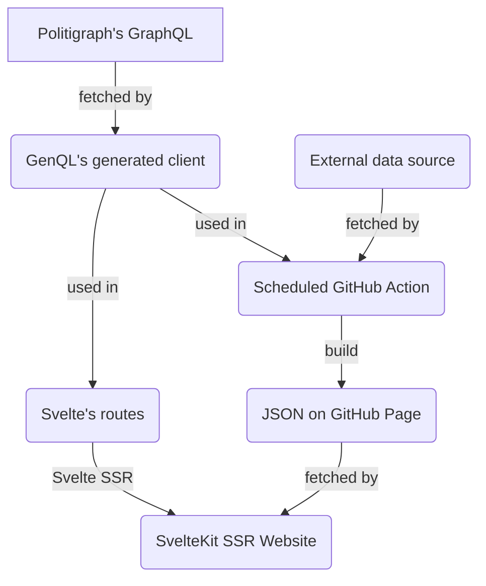

# 👀 Parliament Watch

Citizens are watching.


**Table of Contents**

<!-- START doctoc generated TOC please keep comment here to allow auto update -->
<!-- DON'T EDIT THIS SECTION, INSTEAD RE-RUN doctoc TO UPDATE -->

- [⭐ Goal](#-goal)
- [🌎 Deployment](#-deployment)
  - [One-time server setup](#one-time-server-setup)
  - [Rollback](#rollback)
- [🍱 Tech Stack](#-tech-stack)
  - [Front-end](#front-end)
  - [Local development](#local-development)
  - [CI/CD pipeline](#cicd-pipeline)
- [💾 Data Source](#-data-source)
- [🗃️ Directory Structure](#-directory-structure)
- [🪄 Useful Commands](#-useful-commands)
  - [Start SvelteKit](#start-sveltekit)
  - [Start Histoire](#start-histoire)
  - [Generate a new component](#generate-a-new-component)
  - [Log](#log)
- [🍭 Design System](#-design-system)
  - [Typography](#typography)
  - [Colors](#colors)
  - [Components](#components)
  - [Icons](#icons)
- [Environment Variables](#environment-variables)
- [🤝 Contributing Guideline](#-contributing-guideline)

<!-- END doctoc generated TOC please keep comment here to allow auto update -->

## ⭐ Goal

We want to record and visualise Thai parliament information, including politicians, assemblies, bills, and voting processes.

This project can be seen as a renovated combination of [They Work for Us](https://github.com/wevisdemo/they-work-for-us), [Law Watch](https://github.com/wevisdemo/law-watch), and [Promise Tracker](https://github.com/wevisdemo/promise-tracker), which aim to support several election eras.

## 🌎 Deployment

| Name                  | URL                                |
| --------------------- | ---------------------------------- |
| Production            | https://parliamentwatch.wevis.info |
| Staging (main branch) | https://pwstaging.wevis.info       |

The app is served with SvelteKit's Node adapter as a Docker container. Staging and production run as two [docker-compose.yml](docker-compose.yml) services on the same server, reaching Politigraph's origin server directly (bypassing Cloudflare — see server setup below), selected by image alias tags: CI loads an immutable `parliament-watch:<git-sha>` image on the server, then moves the `:latest` (staging) / `:production` tag and restarts only that service.

Each service is memory-capped in [docker-compose.yml](docker-compose.yml) (`mem_limit` plus `NODE_OPTIONS=--max-old-space-size` set below it, so V8 garbage-collects before the container is OOM-killed). With Politigraph on a separate host, caddy + production + staging fit on a **1 GB** server. Production is prioritized for real users; staging is capped well below production's budget. The per-service LRU result cache is bounded by both entry count (`POLITIGRAPH_CACHE_MAX_ENTRIES`) and total bytes (`POLITIGRAPH_CACHE_MAX_BYTES`) so it evicts instead of growing unbounded. A ~1 GB swap file is recommended as a spike buffer.

### One-time server setup

1. Create the deploy directory (the `SSH_PATH` GitHub secret must point here) and copy [docker-compose.yml](docker-compose.yml) and the [Caddyfile](Caddyfile) into it.
2. Create a `.env` file in the deploy directory (compose reads it automatically) with:
   - `POLITIGRAPH_URL=https://politigraph.wevis.info/graphql`
   - `POLITIGRAPH_ORIGIN_IP=<politigraph origin server IP>` — keep it out of the repo; it is a secret. `extra_hosts` pins `politigraph.wevis.info` to this IP so SSR queries hit the origin directly, bypassing Cloudflare's proxy and its rate limit. The domain URL is kept so SNI, Host header, and certificate hostname still match; the image trusts [Cloudflare's origin root CA](https://developers.cloudflare.com/ssl/origin-configuration/origin-ca/) (baked in at build via `NODE_EXTRA_CA_CERTS`) so the origin's Cloudflare Origin CA certificate verifies without touching TLS validation settings.
3. The bundled [Caddy](https://caddyserver.com) service terminates TLS with an auto-generated self-signed certificate, compresses dynamic responses, and routes each hostname to its container — set the Cloudflare SSL mode to **Full** (or mount a Cloudflare Origin CA certificate and switch the `tls` directive for Full strict).
4. Verify the Cloudflare bypass from inside a running container:

   ```sh
   docker compose exec production node -e \
     "fetch('https://politigraph.wevis.info/graphql',{method:'POST',headers:{'content-type':'application/json'},body:'{\"query\":\"{ __typename }\"}'}).then((r)=>{console.log([...r.headers.keys()].includes('cf-ray')?'via cloudflare!':'direct to origin');return r.text();}).then(console.log)"
   ```

   Expected: `direct to origin` and `{"data":{"__typename":"Query"}}` — a `cf-ray` header would mean requests still pass through Cloudflare.

### Rollback

Images of the last few deploys stay loaded on the server (CI prunes older ones). To roll production back to a previous sha:

```sh
docker tag parliament-watch:<previous-sha> parliament-watch:production
docker compose up -d production
```

`docker image ls parliament-watch` lists what is available.

## 🍱 Tech Stack

### Front-end

- [Svelte](https://svelte.dev) + [SvelteKit](https://kit.svelte.dev)
- [TypeScript](https://www.typescriptlang.org/)
- [Carbon Design System (v10)](https://v10.carbondesignsystem.com) + [Carbon Components Svelte](https://carbon-components-svelte.onrender.com)
- [TailwindCSS](https://tailwindcss.com)
- [Histoire](https://histoire.dev/) for component documentation

### Local development

- [pnpm](https://pnpm.io) as a package manager
- Husky and lint-staged will
  - Lint (ESLint) and format (Prettier) code before committing
  - Validate that commit message is aligned with [conventional commit](https://www.conventionalcommits.org/en/v1.0.0/) using commitlint
  - Run svelte-check before pushing
- For VS Code users, format on save is enabled and the [prettier-vscode extension](https://marketplace.visualstudio.com/items?itemName=esbenp.prettier-vscode) will be recommended when you open the project.
- [Hygen](http://www.hygen.io) for code generation

### CI/CD pipeline

- **Staging**: Each push to `main` triggers the [GitHub Actions workflow](.github/workflows/staging.yml) to test, build the Docker image, rsync it to the server as a tarball, load and start the staging container, and poll `/healthz`. It can also be triggered manually.
- **Production**: The [production workflow](.github/workflows/production.yml) can only be triggered manually. It does not rebuild: over SSH, it retags the image validated on staging as `:production`, restarts the production service, and polls `/healthz` — exact-bits promotion. It then stops the staging container (now a duplicate of production) to free server resources until the next push to `main` deploys a fresh staging build.

## 💾 Data Source

Parliament Watch fetches data from [Politigraph](https://politigraph.wevis.info), a civic-initiated open API for Thai political data. We use [GenQL](https://genql.dev) to generate a type-safe GraphQL client, which communicates with the [Politigraph GraphQL endpoint](https://politigraph.wevis.info/graphql).


```mermaid
flowchart TD
    B[Politigraph's GraphQL] --> |fetched by| C(GenQL's generated client)
    C --> |used in| D(Svelte's routes)
    D --> |Svelte SSR| E(dev/prod website)
    C --> |used in| G(Scheduled GitHub Action)
    F(External data source) --> |fetched by| G
    G --> |build| H(JSON on GitHub Page)
    H --> |fetched by| E(SvelteKit SSR Website)
```

## 🗃️ Directory Structure

- **/\_templates** Hygen's code generation templates
- **/.husky** Husky's git hooks
- **/src** main source code
  - **/components** Svelte's components
  - **/mocks** Mock data while we still do not have a backend
  - **/models** Main data structures defined with TypeScript interfaces
  - **/routes** SvelteKit's routes
  - **/styles** Stylesheets, including the custom Carbon Design System, Tailwind, and fonts
- **/static** Static assets such as logos
- **/tests**
  - **/lib** Unit tests for `src/lib` (`pnpm test`)
  - **/e2e** Journey smoke tests against a running server (`E2E_BASE_URL=... pnpm run test:e2e`)

## 🪄 Useful Commands

### Start SvelteKit

Start the project in development mode.

```bash
pnpm run dev
```

### Start Histoire

To see and develop custom components from Histoire's stories.

```bash
pnpm run story:dev
```

Stories are baked into the deployed image and available at https://parliamentwatch.wevis.info/stories/.

### Generate a new component

For a shared component

```bash
pnpm run gen:component
```

The `/src/components/ComponentName/` directory will be created with the following files:

- **ComponentName.svelte** for the component source code.
- **ComponentName.story.svelte** for the Histoire story file. Follow [a guide on writing stories](https://histoire.dev/guide/svelte3/stories.html).

### Log

Server-side logging for data warnings and SvelteKit errors can be enabled via the `process.env.LOG_TARGET` environment variable by setting it to `stdout` or `file`. More details are in [logger.ts](src/lib/logger.ts).

## 🍭 Design System

The project design system is based on Carbon Design System v10 with some modifications. The custom theme is defined with SCSS in [src/styles/carbon/](src/styles/carbon/). To reduce development overhead, we compile Carbon-related stylesheets into `src/styles/carbon/pre-compiled.css` with the `pnpm run sass:build` command.

### Typography

- The utility classes are globally available as declared in [typography.scss](src/styles/carbon/typography.scss).
- See [Figma file](<https://www.figma.com/file/wydykFjb2U2SLFIz5YmiE8/(v11)-Text-Styles---IBM-Design-Language-(Community)>)

### Colors

- [tailwind.config.js](tailwind.config.js) defines utility classes based on color function names according to the Carbon theme (see [Figma file](<https://www.figma.com/file/JhpIXQHbn07yn2GVD806dA/(v10)-White-Theme---Carbon-Design-System-(Community)>)).
- SCSS variables, which need to be imported wherever you want to use them:
  - [colors.scss](src/styles/carbon/colors.scss) defines variables for the full color palette (see [Figma file](<https://www.figma.com/file/DLpm4GWpqa1BUEWApXGeGc/Color-Styles---IBM-Design-Language-(Community)>)).
  - [theme.scss](src/styles/carbon/theme.scss) defines variables according to the Carbon theme's color function names (see [Figma file](<https://www.figma.com/file/JhpIXQHbn07yn2GVD806dA/(v10)-White-Theme---Carbon-Design-System-(Community)?node-id=169%3A0>)).

### Components

- Use [Carbon Components Svelte](https://carbon-components-svelte.onrender.com).
- We have custom shared components available in [src/components/](src/components/).
  - To see the shared components' stories, open [Histoire on production](https://parliamentwatch.wevis.info/stories/) or run locally with `pnpm run story:dev`.
- If the component is not yet developed:
  - If the component is used by only a specific route, create it in `/src/components/route-name-and-sub-route-if-exist/`.
  - If the component is shared, run `pnpm run gen:component` to generate a new component. Do not forget to update the story file for the component documentation.

### Icons

- Use [Carbon Icons Svelte](https://carbon-icons-svelte.onrender.com).
- We have custom icons available in [src/components/icons](src/components/icons), using the same props as Carbon's icons. They are also available in Histoire.
- See [Figma file](<https://www.figma.com/file/TUob8dLak4FMugrqMQRm3R/Icons---IBM-Design-Language-(Community)>)

## Environment Variables

All variables are optional for local development; production values are set in [docker-compose.yml](docker-compose.yml).

| Variable                         | Meaning                                                                                            |
| -------------------------------- | -------------------------------------------------------------------------------------------------- |
| `ORIGIN`                         | Public origin, required by the Node adapter for absolute URLs and CSRF                             |
| `PORT`                           | Server listen port (default 3000)                                                                  |
| `POLITIGRAPH_URL`                | GraphQL endpoint (default `https://politigraph.wevis.info/graphql`; a local address in production) |
| `POLITIGRAPH_REQUEST_PER_SECOND` | Upstream rate limit (safety valve, default 3)                                                      |
| `POLITIGRAPH_CACHE_TTL_SECONDS`  | Query result cache TTL, `0` disables (default 900)                                                 |
| `POLITIGRAPH_CACHE_MAX_ENTRIES`  | Query result cache entry-count bound (default 500)                                                 |
| `POLITIGRAPH_CACHE_MAX_BYTES`    | Query result cache total-size bound in bytes (default 33554432, i.e. 32 MiB)                       |
| `LOG_TARGET`                     | `stdout` or `file` for pino logs (see [logger.ts](src/lib/logger.ts))                              |

## 🤝 Contributing Guideline

Please read [CONTRIBUTING.md](CONTRIBUTING.md)
