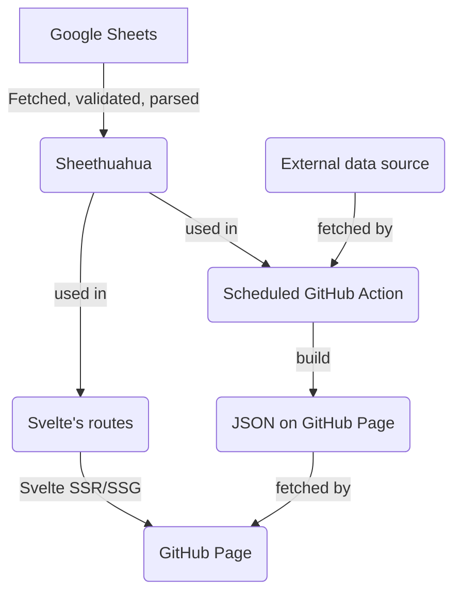

# 👀 Parliament Watch

Citizens are watching


**Table of Contents**

<!-- START doctoc generated TOC please keep comment here to allow auto update -->
<!-- DON'T EDIT THIS SECTION, INSTEAD RE-RUN doctoc TO UPDATE -->

- [⭐ Goal](#-goal)
- [🌎 Environments](#-environments)
- [🍱 Tech Stack](#-tech-stack)
  - [Front-end](#front-end)
  - [Local development](#local-development)
  - [Deployment pipeline](#deployment-pipeline)
- [🪄 Useful Commands](#-useful-commands)
  - [Start SvelteKit](#start-sveltekit)
  - [Start Histoire](#start-histoire)
  - [Generate a new component](#generate-a-new-component)
  - [Log](#log)
- [🗃️ Directory Structure](#-directory-structure)
- [🍭 Design System](#-design-system)
  - [Typography](#typography)
  - [Colors](#colors)
  - [Components](#components)
  - [Icons](#icons)
- [💾 Data Pipeline](#-data-pipeline)
  - [Migrating away from: Google Sheets](#migrating-away-from-google-sheets)
  - [Migrating to: Politigraph](#migrating-to-politigraph)
- [🤝 Contributing Guideline](#-contributing-guideline)
- [📜 License](#-license)

<!-- END doctoc generated TOC please keep comment here to allow auto update -->

## ⭐ Goal

We want to record and visualise the Thai parliament information including politicians, assemblies, bills, voting processes, and promises.

This project can be seen as a renovated combination of [They Work for Us](https://github.com/wevisdemo/they-work-for-us), [Law Watch](https://github.com/wevisdemo/law-watch), and [Promise Tracker](https://github.com/wevisdemo/promise-tracker) which aim to support several election eras.

## 🌎 Environments

| Name                  | URL                                    |
| --------------------- | -------------------------------------- |
| Production            | https://parliamentwatch.wevis.info     |
| Staging (main branch) | ~~https://parliament-watch.pages.dev~~ |

**Currently pausing due to the backend migration**

## 🍱 Tech Stack

### Front-end

- [Svelte](https://svelte.dev) + [SvelteKit](https://kit.svelte.dev)
- [TypeScript](https://www.typescriptlang.org/)
- [Carbon Design System (v10)](https://v10.carbondesignsystem.com) + [Carbon Components Svelte](https://carbon-components-svelte.onrender.com)
- [TailwindCSS](https://tailwindcss.com)
- [Histoire](https://histoire.dev/) for the components documentation

### Local development

- [pnpm](https://pnpm.io) as a package manager
- Husky and lint-staged will
  - Lint (ESLint) and format (Prettier) code before committing
  - Validate that commit message is aligned with [conventional commit](https://www.conventionalcommits.org/en/v1.0.0/) using commitlint
  - Run svelte-check before pushing
- For VSCode user, format on save is enabled and [prettier-vscode extension](https://marketplace.visualstudio.com/items?itemName=esbenp.prettier-vscode) will be recommended when open the project.
- [Hygen](http://www.hygen.io) for a code generation

### Deployment pipeline

- **Staging**: ~~Each push will trigger the [Github Actions Workflow](.github/workflows/staging.yml) to build the site, upload the build artifact, and deploy on [Cloudflare Pages](https://pages.cloudflare.com). Can also be triggered manually.~~ We are pausing staging CI/CD pipeline in GitHub Action due to the failed build during new data backend migration.
- **Production**: The [Github Actions Workflow](.github/workflows/staging.yml) can only be manually triggered to download the latest build artifact and upload to our server through SSH.

## 🪄 Useful Commands

### Start SvelteKit

Start the project in development mode

```bash
pnpm run dev
```

### Start Histoire

to see/develop custom components from Histoire's stories

```bash
pnpm run story:dev
```

### Generate a new component

For a shared component

```bash
pnpm run gen:component
```

_src/components/ComponentName/_ directory will be created with the following files:

- **ComponentName.svelte** for the component source code.
- **ComponentName.story.svelte** for the Histoire's story file. Follow [a guide on writing stories](https://histoire.dev/guide/svelte3/stories.html).

### Log

Server-side logging for data warning and SvelteKit error can be enabled via environment variable `process.env.LOG_TARGET` by setting it to `stdout` or `file`. More details in [logger.ts](src/lib/logger.ts).

## 🗃️ Directory Structure

- **/\_templates** Hygen's code generation templates
- **/.husky** Husky's git hooks
- **/src** main source codes
  - **/components** Svelte's components
  - **/mocks** Mock data, while we still don't have backend
  - **/models** Main data structure defined with TypeScript interface
  - **/routes** Sveltekit's routes
  - **/styles** Stylesheets, including custom Carbon Design System, tailwind and fonts
- **/static** static assets such as logos

## 🍭 Design System

The project design system is based on Carbon Design System v10 with some modification. Custom theme is defined with SCSS in [src/styles/carbon/](src/styles/carbon/). To reduce overhead on development, we compile Carbon related stylesheet into _src/styles/carbon/precompiled.css_ with `pnpm run sass:build` command.

### Typography

- The utility classes are globally available as declared in [typography.scss](src/styles/carbon/typography.scss)
- See [Figma file](<https://www.figma.com/file/wydykFjb2U2SLFIz5YmiE8/(v11)-Text-Styles---IBM-Design-Language-(Community)>)

### Colors

- [tailwind.config.js](tailwind.config.js) define utility classes based on color function name according to the Carbon's theme (see [Figma file](<https://www.figma.com/file/JhpIXQHbn07yn2GVD806dA/(v10)-White-Theme---Carbon-Design-System-(Community)>))
- SCSS variable (need to be imported where you want to use)
  - [colors.scss](src/styles/carbon/colors.scss) define variable of all color palette (see [Figma file](<https://www.figma.com/file/DLpm4GWpqa1BUEWApXGeGc/Color-Styles---IBM-Design-Language-(Community)>))
  - [theme.scss](src/styles/carbon/theme.scss) define variable according to the Carbon theme's color function name (see [Figma file](<https://www.figma.com/file/JhpIXQHbn07yn2GVD806dA/(v10)-White-Theme---Carbon-Design-System-(Community)?node-id=169%3A0>))

### Components

- Use [Carbon Components Svelte](https://carbon-components-svelte.onrender.com)
- We have custom shared component available in [src/components/](src/components/).
  - To see shared components' story, open Histoire in local with `pnpm run story:dev`
- If the component is not yet developed:
  - If the component is used by only a specific route, create it in _src/components/route-name-and-sub-route-if-exist/_
  - If the component is shared, run `pnpm run gen:component` to generate a new component. Don't forget to update a story file for the component documentation.

### Icons

- Use [Carbon Icons Svelte](https://carbon-icons-svelte.onrender.com)
- We have custom icon available in [src/components/icons](src/components/icons), using the same props as Carbon's icon. (Also available in Histoire)
- See [Figma file](<https://www.figma.com/file/TUob8dLak4FMugrqMQRm3R/Icons---IBM-Design-Language-(Community)>)

## 💾 Data Pipeline

We are migrating away from Google Sheets to our new political GraphQL service called ["Politigraph"](https://politigraph.wevis.info). The data that are completely migrated are:

- [x] Politicians
- [x] Political Parties
- [x] Assemblies
- [x] Vote Events
- [ ] Bills
- [ ] Promises

### Migrating away from: Google Sheets

Data is pre-process server-side during the Static Site Generation (SSG) build step as following



- Original data is available at our public [Google Sheets](https://docs.google.com/spreadsheets/d/1SbX2kgAGsslbhGuB-EI_YdSAnIt3reU1_OEtWmDVOVk/edit?usp=sharing)
- [lib/datasheets](src/lib/datasheets/index.ts) provides functions using [Sheethuahua](https://punchupworld.github.io/sheethuahua/) to fetch, validate, and parse data from Google Sheets.
- The [src/models](src/models) contains ER Diagram and other TypeScript's interfaces.
- Some data, such as politician ranking from external source, will be updated periodically through [scheduled GitHub Action](.github/workflows/update-ranking.yml) to reduce unnecessary build-time. The output JSON data is [served through GitHub Pages](https://wevisdemo.github.io/parliament-watch/politician-ranking.json) and can be fetched from the client-side.

### Migrating to: Politigraph

[Politigraph](https://politigraph.wevis.info) is a Thai politics graph database using GraphQL and Neo4j. Fully migrated to this will allow us to run Parliament Watch in SSR mode, requesting data from Politigraph in real-time.


- We use [GenQL](https://genql.dev) to generate type-safe GraphQL client, communicating with [Politigraph](https://politigraph.wevis.info) GraphQL endpoint

## 🤝 Contributing Guideline

Please read [CONTRIBUTING.md](CONTRIBUTING.md)

## 📜 License

Our team is committed to developing all projects as Open Source and releasing data as Open Data under the [Attribution-NonCommercial-ShareAlike 4.0 International](https://creativecommons.org/licenses/by-nc-sa/4.0/) license. This means the work can be used, adapted, and built upon, but it must not be used for commercial purposes or profit-making. Credit must be given to the original creators, and any derivative work must be shared under the same license as the original. WeVis Ltd. and Punch Up Ltd. are the joint licensors of this license.
