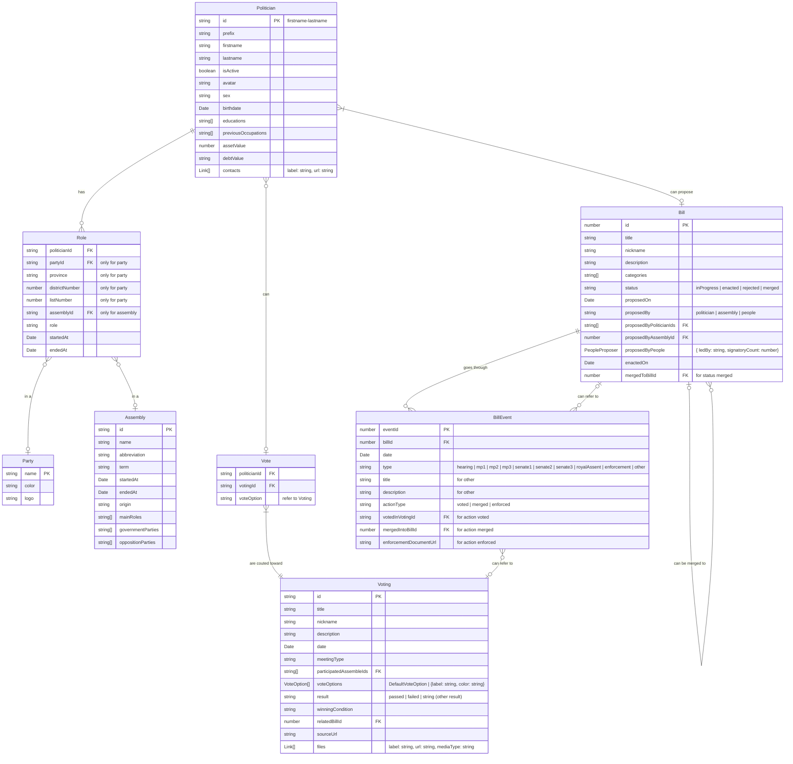

# Data Model

- **Politician** = นักการเมือง
- **Role** = ตำแหน่ง
- **Party** = พรรค
- **Assembly** = กลุ่มคน เช่น สส. สว. ครม.
- **Bill** = ข้อเสนอกฎหมาย
- **BillEvent** = เหตุการต่างๆ ระหว่างการเสนอกฎหมาย
- **Voting** = การลงมติ
- **Vote** = การลงคะแนน
