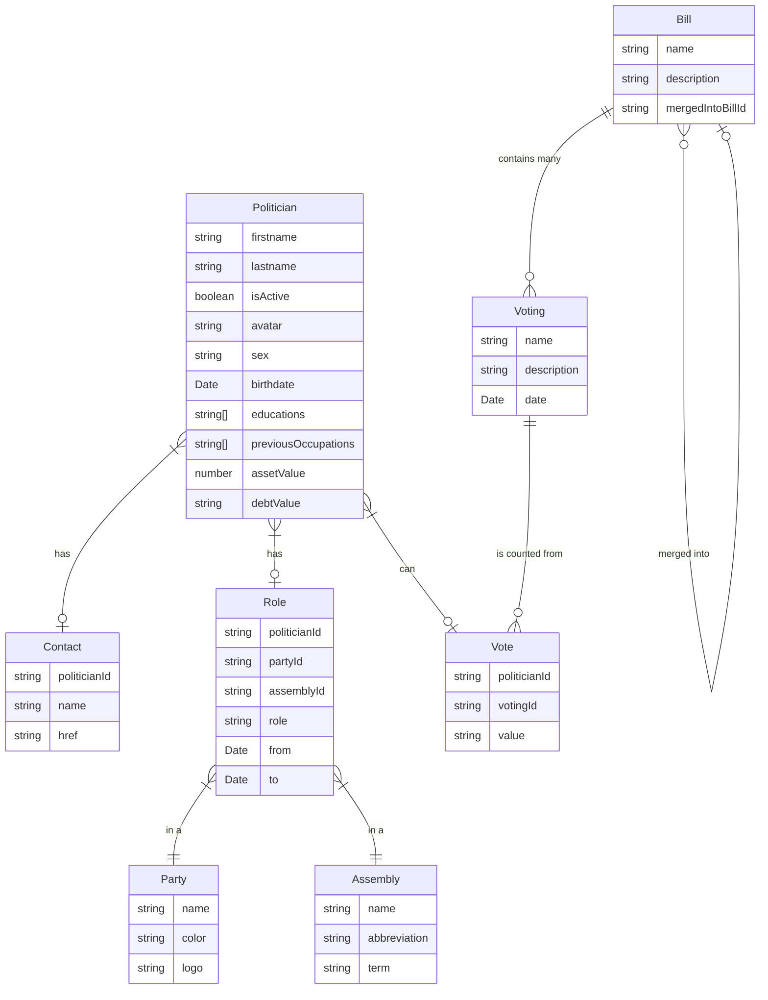

# Data Model

```mermaid
erDiagram
  Politician }|--o| Contact: "has"
  Politician }|--o| Role: "has"
  Role }|--|| Party: "in a"
  Role }|--|| Assembly: "in a"
  Politician }|--o| Vote: "can"
  Bill }o--o| Bill: "merged into"
  Bill ||--o{ Voting: "contains many"
  Voting ||--o{ Vote: "is counted from"

  Politician {
    string firstname
    string lastname
    boolean isActive
    string avatar
    string sex
    Date birthdate
    string[] educations
    string[] previousOccupations
    number assetValue
    string debtValue
  }

  Contact {
    string politicianId
    string name
    string href
  }

  Role {
    string politicianId
    string partyId
    string assemblyId
    string role
    Date from
    Date to
  }

  Party {
    string name
    string color
    string logo
  }

  Assembly {
    string name
    string abbreviation
    string term
  }

  Bill {
    string name
    string description
    string mergedIntoBillId
  }

  Voting {
    string name
    string description
    Date date
  }

  Vote {
    string politicianId
    string votingId
    string value
  }


```

- **Politician** = นักการเมือง
- **Role** = ตำแหน่ง
- **Party** = พรรค
- **Assembly** = สส. สว. ครม.
- **Bill** = ข้อเสนอกฏหมาย
- **Voting** = การลงมติ
- **Vote** = การลงคะแนน
